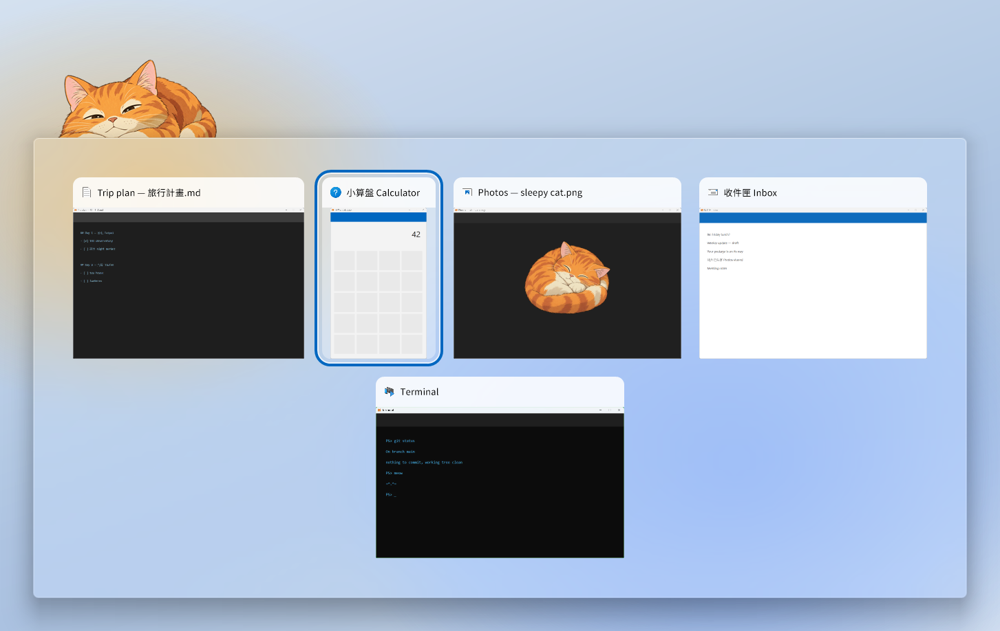
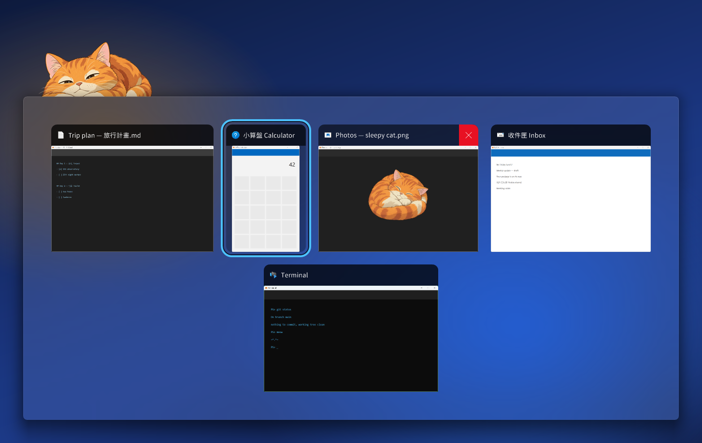

# MeowTab

**Alt+Tab the Windows 11 way, with a cat peeking over the edge.**

MeowTab replaces Alt+Tab with a switcher that looks like the one built into Windows 11: live previews of your windows in a grid, on a frosted acrylic pane that follows light and dark mode. Then it adds one small, silly thing: a picture peeks over the pane's top-left edge, and it changes with how many windows you have open. A sleepy cat when you have a few, a cat sitting up straight when it's getting crowded. Swap in your own pictures and let your pet, your mascot or your boss judge your window count.



> **Status: early preview (0.1).** MeowTab grew out of [peek-alttab](https://github.com/tingtmu/peek-alttab) and is being polished into a full app; see the [roadmap](ROADMAP.md). There's no installer yet: run it with AutoHotkey (see [Quick start](#quick-start)) or [build the exe](#building-the-exe) yourself.

## Contents

- [Features](#features)
- [Requirements](#requirements)
- [Quick start](#quick-start)
- [Usage](#usage)
- [Settings panel](#settings-panel)
- [Use your own pictures](#use-your-own-pictures)
- [Two styles](#two-styles)
- [Settings](#settings)
- [How it works](#how-it-works)
- [Building the exe](#building-the-exe)
- [Tests](#tests)
- [Known issues](#known-issues)
- [Roadmap](#roadmap)
- [License](#license)

## Features

- **Looks native.** A grid of live window thumbnails, each with its app icon and title, on Windows 11's own acrylic material. The selection gets the accent-coloured ring Windows uses. Light or dark follows your Windows mode, and the ring follows your accent colour.

  

- **The peek.** A mood picture sits on the pane's top-left edge, slides up when the switcher opens and rises a little higher the more windows you have:

  | Mood | Windows (default) | Default picture |
  | --- | --- | --- |
  | few | 1-2 | a cat curled up asleep |
  | some | 3-7 | a cat lounging |
  | many | 8+ | a cat sitting up, very much awake |

- **Your own pictures.** Pick or drop them in the settings panel. **Clean background** cuts out a plain light background and crops to a square, built in.
- **Keyboard and mouse.** Tab and the arrow keys move through the grid (Up and Down change rows), Delete closes a window and keeps the switcher open, Esc cancels. Hover a tile for its close button; click a tile to switch to it.
- **Your current screen only.** Only windows on the focused monitor are listed, most recently used first. Windows hides windows on other virtual desktops, and tiling window managers such as GlazeWM hide other workspaces, so this means the desktop or workspace you're on. Recency comes from window activations, not stacking order, so a re-tile doesn't shuffle the list.
- **Readable titles in any language.** Titles use Noto Sans TC when it's installed (clear for mixed Chinese and English), otherwise Segoe UI. Any installed font works, set from the settings panel.

## Requirements

- Windows 11, 64-bit. The acrylic pane needs version 22H2 or later; older builds get a solid pane.
- [AutoHotkey](https://www.autohotkey.com/) v2.0 or newer, to run the `.ahk` scripts. A [built exe](#building-the-exe) needs nothing else.

## Quick start

1. Install [AutoHotkey v2](https://www.autohotkey.com/).
2. Get the code: **Code > Download ZIP** on this page (then unzip it into a folder of your own, such as Documents), or

   ```
   git clone https://github.com/tingtmu/meowtab.git
   ```

3. Double-click `meowtab.ahk`. Hold **Alt** and press **Tab**.

Double-click the tray icon (a sleepy cat) to open the [settings panel](#settings-panel). Right-click it to reload or exit, or to tick **Desktop icon**, which puts a shortcut on your desktop that opens the panel.

**Run at login:** press `Win+R`, type `shell:startup`, and put a shortcut to `meowtab.ahk` in the folder that opens.

**With GlazeWM (optional):** add it to `startup_commands` in GlazeWM's `config.yaml`:

```yaml
general:
  startup_commands: ['shell-exec C:\path\to\meowtab\meowtab.ahk']
```

To make MeowTab exit when GlazeWM quits, put this in `%APPDATA%\MeowTab\settings.ini` (the settings panel keeps the line when it saves):

```ini
[settings]
WM_PROCESS=glazewm.exe
```

**Good to know**

- Windows doesn't let a normal app's hotkeys reach an elevated (administrator) window, so while one is focused you get the built-in Alt+Tab. To cover those windows too, run MeowTab as administrator.
- It never connects to the network. Your settings and pictures stay on your PC, in `%APPDATA%\MeowTab`.

## Usage

Hold **Alt**, then:

| Keys | Action |
| --- | --- |
| `Tab` / `Shift+Tab` | Next / previous window |
| `Right` / `Left` | Next / previous window |
| `Down` / `Up` | The tile below / above |
| Release `Alt` | Switch to the selected window |
| `Esc` | Cancel without switching |
| `Delete` | Close the selected window and keep the switcher open |

With **Alt** still held, the mouse works too: click a tile to switch to it, or hover it and click its **×** to close that window. The mouse wheel scrolls when there are more windows than fit.

The first Tab picks the window you were in before. Apps that ask "save changes?" on close stay in the list until you answer.

## Settings panel

Double-click the tray icon, or right-click it and choose **Settings…**. The desktop icon (tray menu > **Desktop icon**) opens it too.


- **Mood images.** One card per mood. Click a card to choose a picture (PNG, JPG, BMP or GIF), or drag a file onto it. The `−  3  +` steppers set where "some" and "many" start.
- **Clean background** (`✧ Clean`, on a card with your own picture) removes a plain light background and crops the picture to a square.
- **Peek height.** How much of the picture shows above the pane with a single window, and once the count reaches "many". The two little scenes preview it with your own pictures.
- **Title font.** Any installed font, at 10 to 24 pt.

**Save** (or Enter) writes `%APPDATA%\MeowTab\settings.ini` and reloads it. **Cancel** (or Esc) changes nothing. **Reset to defaults** removes the panel's settings from `settings.ini`; it never deletes pictures and keeps lines you added yourself, such as `WM_PROCESS`.

The panel is built when you open it and freed when you close it, so it never slows Alt+Tab down.

## Use your own pictures

The settings panel is the easy way. Your pictures are copied into `%APPDATA%\MeowTab\images\` as `custom_few.png`, `custom_some.png` and `custom_many.png`; the shipped `chill_*` cats are never overwritten. Large pictures are scaled down to 1024 px and photos are turned upright.

By hand: put three PNGs in `%APPDATA%\MeowTab\images\` named `<prefix>_few.png`, `<prefix>_some.png` and `<prefix>_many.png`, set `IMG_PREFIX=<prefix>` in `settings.ini`, then **Reload Script** from the tray menu.

Tips:

- A **square PNG with a transparent background** works best. Any resolution is fine; a non-square picture keeps its shape.
- How much of the picture peeks out ignores transparent padding, so a small subject in a big canvas still peeks properly.
- A missing file just means no picture for that mood.

Pull requests adding picture sets to `images/` are welcome. Please only submit art you made yourself or art whose license allows redistribution.

## Two styles

| Script | Look |
| --- | --- |
| `meowtab.ahk` (main) | Windows 11 style: a grid of live previews on acrylic, the picture peeking over the top-left edge. |
| `meowtab-classic.ahk` | The original layout: a list of titles with one large preview beside it, the picture inside the pane's bottom-left corner. |

Run only one at a time; both replace Alt+Tab. The other `.ahk` files are parts the two scripts include, not meant to be run on their own.

## Settings

The block at the top of each script holds the built-in defaults; `%APPDATA%\MeowTab\settings.ini` overrides them. The settings panel writes it, and you can add lines by hand under `[settings]` (as `NAME=value`) for the keys marked *ini*. Every value read from `settings.ini` is checked: an invalid one falls back to its default, an out-of-range one is clamped, and a tray notification says which. A `settings.ini` from an older checkout (where it sat beside the script) is no longer read: move it to `%APPDATA%\MeowTab` by hand, and any `custom_*.png` from `images\` into its `images\` folder.

| Setting | Default | Applies to | Set in | What it does |
| --- | --- | --- | --- | --- |
| `FONT_NAME` | Noto Sans TC (else Segoe UI) | both | panel | Title font (classic: list font). |
| `FONT_SIZE` | `10` / `16` | main / classic | panel | Text size in points (10-24). |
| `IMG_PREFIX` | `chill` | both | panel | Pictures are `<prefix>_few.png`, `_some.png`, `_many.png`. The panel uses `custom`. |
| `SOME_FROM` | `3` | both | panel | Fewest windows that count as "some". |
| `MANY_FROM` | `8` | both | panel | Fewest windows that count as "many" (2 ≤ `SOME_FROM` < `MANY_FROM` ≤ 30). |
| `PEEK_MIN` | `0.72` | main | panel | Share of the picture shown above the pane with 1 window. |
| `PEEK_MAX` | `0.95` | main | panel | Share shown at `MANY_FROM + 4` windows and beyond (0.30-1.00, above `PEEK_MIN`). |
| `IMG_SIZE` | `250` / `100` | main / classic | ini | Picture size in pixels. |
| `WM_PROCESS` | empty | both | ini | Exit when this process is gone, e.g. `glazewm.exe`. |
| `LIST_WIDTH` | `700` | classic | ini | List width in pixels. |
| `MAX_ROWS` | `15` | classic | ini | Longer lists scroll. |
| `PREVIEW_W` | `800` | classic | ini | Preview width in pixels; `0` turns it off. |
| `IMG_ROWS` | `12` | classic | ini | The list covers the picture only beyond this many windows. |

`meowtab.ahk` also has a **Native look** block of constants just below the settings (pane padding, tile sizes and gaps, the selection ring, the close button, light and dark colours), each line commented, for tinkering.

## How it works

For the curious, all in AutoHotkey v2 with plain Win32 calls:

- **Acrylic without stealing focus.** The pane is a popup that is never activated, so your window keeps the keyboard until you switch. Windows only draws acrylic for an active-looking window, so MeowTab asks DWM for the transient (flyout) backdrop, turns non-client rendering on and marks the frame active (`WM_NCACTIVATE`) without activating anything.
- **Live previews** are DWM thumbnails, cropped to each window's visible frame.
- **Everything else on the pane** (headers, icons, titles, the ring) is drawn with GDI+ into a 32-bit surface with real per-pixel alpha, so the acrylic shows through where nothing is drawn.
- **The peek** is a separate click-through window that shows only the part of the picture above the pane's edge, so nothing of it shows blurred through the glass.

## Building the exe

`build.ps1` compiles both scripts and packs a zip:

```
powershell -ExecutionPolicy Bypass -File build.ps1
```

It needs AutoHotkey v2 (found in its usual install folders, or pass `-Base <path to AutoHotkey64.exe>`). The compiler, Ahk2Exe, comes from `-Ahk2Exe <path>`, the `AHK2EXE` environment variable or AutoHotkey's `Compiler` folder; failing those, the latest [Ahk2Exe release](https://github.com/AutoHotkey/Ahk2Exe/releases) is downloaded into `build\` (nothing is installed). The result is `dist\meowtab\` and `dist\meowtab.zip`, which holds only the two exes, the `chill_*` pictures, this README and the license.

**Clean background** is C (`cutout.c`) compiled to machine code stored in `cutout-mcode.ahk`, so neither the scripts nor the exes need a compiler. `build-mcode.ps1` regenerates it from `cutout.c` with a pinned, hash-checked [Zig](https://ziglang.org); run it after editing `cutout.c`. CI checks the file is up to date.

[GitHub Actions](.github/workflows/build.yml) builds the zip from a version tag, with pinned, hash-checked copies of AutoHotkey and Ahk2Exe.

## Tests

From the repo root (close any running copy first; adjust the path if AutoHotkey is installed elsewhere):

```
& "$env:ProgramFiles\AutoHotkey\v2\AutoHotkey64.exe" /ErrorStdOut tests\meowtab.test.ahk | more
```

`tests\meowtab.test.ahk` opens a few temporary windows, drives the real switching code and prints `PASS`/`FAIL` per check, ending with `ALL PASSED`. It covers recency order (including after a re-tile), Alt+Tab, Alt+Tab+Tab, the live previews being registered and released, the arrow keys, and switching and closing with the mouse. It needs an unlocked, connected desktop.

`tests\cutout.test.ahk` checks **Clean background** against the expected results in `tests/cutout/`; CI runs it too.

`tools\readme-shots.ahk` takes the screenshots above from the real pane. It lists only its own demo windows over a stand-in wallpaper, so none of your own windows can end up in an image.

## Known issues

- With many windows the thumbnails shrink before the grid scrolls, and there's no scroll bar yet.
- Preview corners are square at the bottom (Windows' own are rounded).
- Ctrl+Alt+Tab (the switcher that stays open without holding Alt) isn't supported yet.
- Only the focused monitor's windows are listed, so on a monitor without windows Alt+Tab does nothing.

## Roadmap

Fixed-size tiles with a smooth scroll bar, a softer "Velvet" look, a new demo GIF and more are planned: see [ROADMAP.md](ROADMAP.md).

## License

MIT. See [LICENSE](LICENSE).

The default cat pictures (and the icon made from one) are AI-generated placeholders, included under the same license.
