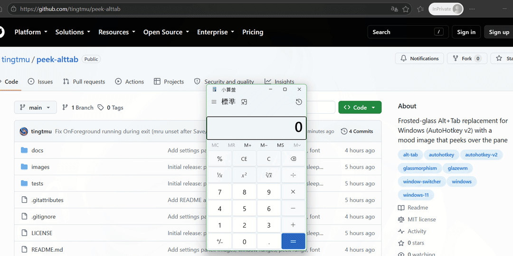
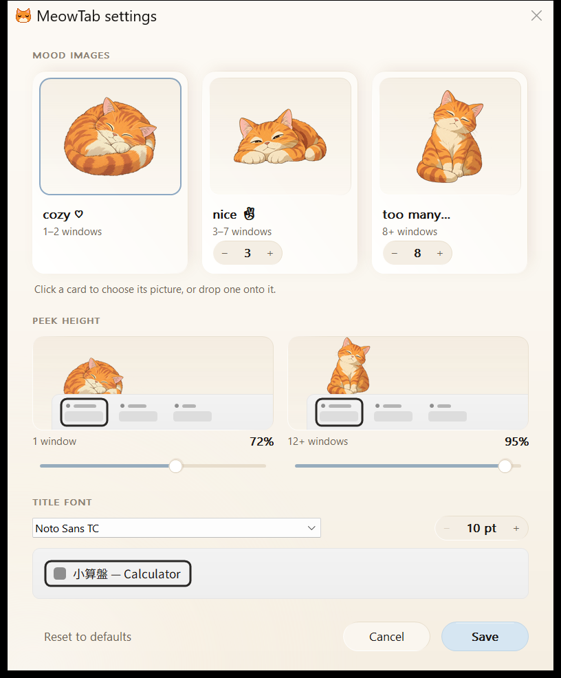

# peek-alttab

A frosted-glass Alt+Tab replacement for Windows, written in AutoHotkey v2. It shows a live preview of the selected window, and a little mood image peeks over the edge of the pane, changing with how many windows you have open.



[](https://github.com/tingtmu/peek-alttab/releases/latest/download/peek-alttab.zip)

No install needed: unzip, double-click `peek-alttab.exe`, hold Alt and press Tab. See [Quick start](#quick-start).

## Contents

- [Features](#features)
- [Two styles](#two-styles)
- [Requirements](#requirements)
- [Quick start](#quick-start)
  - [Run at login](#run-at-login)
  - [With GlazeWM (optional)](#with-glazewm-optional)
  - [Good to know](#good-to-know)
- [Usage](#usage)
- [Settings panel](#settings-panel)
- [Use your own images](#use-your-own-images)
  - [Share your image sets](#share-your-image-sets)
- [Settings](#settings)
- [Building the exe](#building-the-exe)
- [Tests](#tests)
- [License](#license)

## Features

- Frosted-glass pane with a live preview (DWM thumbnail) of the highlighted window.
- A "mood image" that follows your window count: **few** (1-2) says "cozy ♡", **some** (3-7) says "nice ✌", **many** (8+) says "too many…". The ranges are yours to change.
- Lists only the windows on the focused monitor, most recently used first. Windows cloaks windows on other virtual desktops, and tiling window managers (such as GlazeWM) cloak hidden workspaces, so in practice this means the current desktop or workspace.
- Works with or without a tiling window manager. Recency is tracked from foreground changes rather than Z-order, so a re-tile does not shuffle the list.
- Close the selected window with Alt+Delete and the list stays open.
- Soft selection pill that glides between rows, a gentle fade-in on open, and a faint glow around the preview tinted from the selected app's icon colour.
- A settings panel (tray icon > **Settings…**): drop in your own pictures, set the window ranges, how far the image peeks and the list font, no code editing needed.

## Two styles

Run **only one** of these at a time. Both replace Alt+Tab, and each comes as an `.exe` (in the release zip) and as an `.ahk` script.

| Switcher | Look |
| --- | --- |
| `peek-alttab` (main) | Glass look. The image peeks over the pane's top-left edge from behind, slides up when the pane opens, and glides when the window count changes. |
| `elegant-alttab` | Simpler pane. The image sits inside the pane's bottom-left corner. |

`alttab-glass.ahk`, `gdip-helpers.ahk`, `cutout.ahk`, `desktop-icon.ahk` and the `settings-*.ahk` files are helpers that the two scripts include. They are not meant to be run directly.

## Requirements

- Windows 11 (64-bit for the exe).
- [AutoHotkey](https://www.autohotkey.com/) v2.0 or newer, only if you run the `.ahk` scripts. The exe needs nothing else.

## Quick start

Pick one of these:

**1. Download (easiest, nothing to install)**

1. Download [peek-alttab.zip](https://github.com/tingtmu/peek-alttab/releases/latest/download/peek-alttab.zip) from the latest release.
2. Right-click it > **Extract All…**, into a folder of your own such as Documents (not Program Files: your settings and pictures are saved next to the exe).
3. Double-click `peek-alttab.exe`. Hold Alt and press Tab.

The first time, the exe asks whether to put an icon on the desktop (and remembers your answer in `settings.ini`). Clicking that icon starts the switcher, or reloads it if it is already running, and opens the [settings panel](#settings-panel), so you needn't look for the tray icon. You can add or remove it any time with the tray menu's **Desktop icon**.

The exe isn't code-signed, so the first time Windows may say "Windows protected your PC" (SmartScreen, "unrecognized app"). Click **More info**, then **Run anyway**. It is built from the scripts in this repo with the official AutoHotkey compiler; see [Building the exe](#building-the-exe) to build it yourself.

The zip holds `peek-alttab.exe`, `elegant-alttab.exe`, the cat images, this README and the license. To update, extract a newer zip over the folder: your `settings.ini` and `images/custom_*` pictures are kept.

**2. Already have AutoHotkey v2**

Download the source ([Code > Download ZIP](https://github.com/tingtmu/peek-alttab/archive/refs/heads/main.zip)), unzip it, and double-click `peek-alttab.ahk`.

**3. git clone** (to contribute, or update with `git pull`)

```
git clone https://github.com/tingtmu/peek-alttab.git
```

Then double-click `peek-alttab.ahk`.

Double-click the tray icon, a sleepy cat (or right-click it > **Settings…**), to open the [settings panel](#settings-panel). Right-click it to reload or exit, or to tick **Desktop icon**, which puts a shortcut on your desktop that opens the panel.

### Run at login

Press `Win+R`, type `shell:startup`, and put a shortcut to `peek-alttab.exe` (or `peek-alttab.ahk`) in the folder that opens.

### With GlazeWM (optional)

Add the switcher to `startup_commands` in GlazeWM's `config.yaml`:

```yaml
general:
  startup_commands: ['shell-exec C:\path\to\peek-alttab\peek-alttab.exe']
```

(or `peek-alttab.ahk`). Then make it exit when GlazeWM quits: create `settings.ini` next to it (or open it, if the panel already made one) and add this line under `[settings]`:

```ini
[settings]
WM_PROCESS=glazewm.exe
```

With the `.ahk` you can instead set `WM_PROCESS := "glazewm.exe"` at the top of the script. Reload it from the tray menu. The panel keeps this line when it saves.

### Good to know

- Windows doesn't let a normal script's hotkeys reach an elevated (administrator) window, so while one is focused you get the native Alt+Tab. To cover those windows too, run the switcher as administrator.
- Antivirus tools now and then flag compiled AutoHotkey programs by mistake. If yours does, run the `.ahk` script instead (option 2).
- It never connects to the network. Your settings and pictures stay in its own folder.

## Usage

Hold **Alt**, then:

| Keys | Action |
| --- | --- |
| `Tab` | Next window |
| `Shift+Tab` | Previous window |
| `Down` / `Right` | Next window |
| `Up` / `Left` | Previous window |
| Release `Alt` | Switch to the highlighted window |
| `Esc` | Cancel without switching |
| `Delete` | Close the highlighted window and keep the list open |

The first Tab picks the previous window (the one you were in last). Apps that show a "save changes?" prompt on close stay in the list until the prompt is answered.

## Settings panel

Double-click the tray icon, or right-click it and choose **Settings…**. The **desktop icon** (tray menu > **Desktop icon**) opens it too. It runs the switcher with `/settings`; without that switch, as at login, the switcher starts silently.



- **Mood images.** One card per mood. Click a card to choose a picture (PNG, JPG, BMP or GIF), or drag a file onto it. The small `−  3  +` steppers set where "some" and "many" start; the window ranges under each card update as you go.
- **Clean background** (`✧ Clean` on a card with your own picture) removes its plain light background and crops it to a square. It is built in and needs nothing else. If a picture doesn't suit it, the reason is shown under the cards.
- **Peek height** (`peek-alttab.ahk` only). How much of the picture shows above the pane with a single window, and once the count reaches "many". The two little scenes show it with your own pictures.
- **List font.** Any installed font and a size from 10 to 24, with a sample row.

**Save** (or Enter) writes `settings.ini` next to the script (or exe) and reloads it. **Cancel** (or Esc) changes nothing. **Reset to defaults** (asks first) removes the panel's settings from `settings.ini`. It never deletes pictures, and keeps lines you added yourself, such as `WM_PROCESS`.

Your pictures are copied into `images/` as `custom_few.png`, `custom_some.png` and `custom_many.png`, and the panel switches to that set. Moods you didn't change get a copy of the picture they had, so nothing else changes. The shipped `chill_*` cats are never overwritten. Large pictures are scaled down to 1024 px and photos are turned upright.

The panel is built when you open it and freed when you close it, so it costs nothing while closed and never slows Alt+Tab.

## Use your own images

The default images (sleepy orange cats in `images/chill_few.png`, `chill_some.png` and `chill_many.png`) are placeholders. The [settings panel](#settings-panel) is the easy way to swap them. By hand:

1. Put three PNGs in `images/`, named `<prefix>_few.png`, `<prefix>_some.png` and `<prefix>_many.png`.
2. Set `IMG_PREFIX=<prefix>` in `settings.ini` (or `IMG_PREFIX := "<prefix>"` at the top of the script).
3. Right-click the tray icon and choose **Reload Script**.

Tips:

- A **square PNG with a transparent background** works best. Any resolution is fine: images are scaled once at startup (bicubic) to `IMG_SIZE`. A non-square image keeps its shape and is centred on a transparent square.
- A missing file just means no image for that mood.
- In `peek-alttab.ahk`, `PEEK_MIN` and `PEEK_MAX` control how much of the image shows above the pane (transparent padding is ignored). If your art shows too much or too little, tune them in the panel.

### Share your image sets

Pull requests adding image sets to `images/` are welcome. Please only submit art you made yourself or art whose license allows redistribution.

## Settings

The block at the top of each script holds the built-in defaults. `settings.ini` next to the script overrides them: the panel writes it, and you can also add lines by hand under `[settings]` (as `NAME=value`, e.g. `WM_PROCESS=glazewm.exe`) for the keys marked *ini* below; the panel keeps those lines when it saves. Every value read from `settings.ini` is checked: one that's invalid falls back to its default, one that's out of range is clamped, and a tray notification says which. With the `.ahk` scripts, editing the script itself still works for everything, including the advanced constants, followed by **Reload Script** from the tray menu (the exe reads only `settings.ini`).

| Setting | Default | Applies to | Set in | What it does |
| --- | --- | --- | --- | --- |
| `FONT_NAME` | `"Segoe UI"` | both | panel | List font. |
| `FONT_SIZE` | `16` | both | panel | Text size in points (10-24). |
| `IMG_PREFIX` | `"chill"` | both | panel | Images are `<prefix>_few.png`, `<prefix>_some.png`, `<prefix>_many.png`. The panel uses `custom`. |
| `SOME_FROM` | `3` | both | panel | Fewest windows that count as "some"; "few" is 1 to `SOME_FROM - 1`. |
| `MANY_FROM` | `8` | both | panel | Fewest windows that count as "many". 2 ≤ `SOME_FROM` < `MANY_FROM` ≤ 30. |
| `PEEK_MIN` | `0.72` | peek | panel | Share of the image's art shown above the pane with 1 window. |
| `PEEK_MAX` | `0.95` | peek | panel | Share shown at `MANY_FROM + 4` windows and beyond; in between it rises evenly. 0.30-1.00, above `PEEK_MIN`. |
| `WM_PROCESS` | `""` | both | ini | Optional. The script exits when this process is no longer running, e.g. `glazewm.exe`. Empty means never. |
| `LIST_WIDTH` | `700` | both | ini | List width in pixels. |
| `MAX_ROWS` | `15` | both | ini | Longer lists scroll. |
| `PREVIEW_W` | `800` | both | ini | Live preview width in pixels, to the right of the list. `0` turns the preview off. Capped so it fits on screen. |
| `IMG_SIZE` | `250` / `100` | peek / elegant | ini | Image size in pixels. |
| `IMG_ROWS` | `12` | elegant | ini | The pane is tall enough that the list only covers the image beyond this many windows. |
| `SEPARATOR` | `"   —   "` | both | script | Text between a window's title and its process name. |
| `IMG_DIR` | `"images"` | both | script | Folder of the mood images, relative to the script. |

`peek-alttab.ahk` also has a **"Glass look"** block of constants just below the settings (colours, light direction, shadow, grain, animation timings, selection pill, accent glow). It is there for tweaking; each line is commented.

## Building the exe

`build.ps1` compiles both switchers and packs the release zip:

```
powershell -ExecutionPolicy Bypass -File build.ps1
```

It needs AutoHotkey v2 (found in its usual install folders, or pass `-Base <path to AutoHotkey64.exe>`). The compiler, Ahk2Exe, comes from `-Ahk2Exe <path>`, the `AHK2EXE` environment variable or AutoHotkey's `Compiler` folder; failing those, the latest [Ahk2Exe release](https://github.com/AutoHotkey/Ahk2Exe/releases) is downloaded into `build\` (nothing is installed). The result is `dist\peek-alttab\` and `dist\peek-alttab.zip`. Each exe's name, version and icon come from the `;@Ahk2Exe-…` lines at the top of its script; the icon, `assets/peek-alttab.ico`, is made from `images/chill_few.png` at 40 px and up; its 16 to 32 px sizes are a bold, pixel-drawn cat face that stays sharp in the tray. The build stops if the zip would hold anything beyond the exes, the `chill_*` images, this README and the license.

The **Clean background** code is C (`cutout.c`) compiled to machine code that lives in `cutout-mcode.ahk`, so neither the scripts nor the exes need a compiler or any extra install. `build-mcode.ps1` regenerates that file from `cutout.c` with a pinned, hash-checked [Zig](https://ziglang.org) (downloaded into `build\`, nothing is installed); run it after editing `cutout.c`. CI checks the file is up to date.

Release zips are built by [GitHub Actions](.github/workflows/build.yml) from a version tag, with pinned, hash-checked copies of AutoHotkey and Ahk2Exe.

## Tests

`tests/peek-alttab.test.ahk` is an integration test that includes `peek-alttab.ahk`. It opens a few temporary windows on your current desktop, then checks the real switching logic. Run it from the repo root (close any running copy of the script first):

```
& "$env:ProgramFiles\AutoHotkey\v2\AutoHotkey64.exe" /ErrorStdOut tests\peek-alttab.test.ahk | more
```

It prints `PASS`/`FAIL` per check and ends with `ALL PASSED` (exit code 0) or the number of failures (exit code 1). It checks that:

- the window order follows recency (most recently used first),
- the order survives a Z-order reshuffle without any window being activated,
- Alt+Tab goes to the previous window, and again returns to the original,
- Alt+Tab+Tab lands on the third window,
- the live preview is registered while cycling and released afterwards,
- a window that isn't in the list (a tool window) is handled, and the first Tab picks the first entry,
- Alt+Down moves the selection like Tab.

The last checks can fail on multi-monitor setups when the test's tool window opens on another monitor. That is a test environment quirk, not a regression.

`tests/cutout.test.ahk` is the parity test for **Clean background**: it cleans the pictures in `tests/cutout/fixtures` and compares them with the expected results (made by the script this code replaced, still in the git history). Run it the same way (`tests\cutout.test.ahk`); it also ends with `ALL PASSED`, and CI runs it too.

## License

MIT. See [LICENSE](LICENSE).

The default cat images (and the icon made from one) are AI-generated placeholders, included in this repo under the same license.
